# NoCODE - NoCode - App de Controle de Estoque com AppSheet

Este aplicativo foi criado com AppSheet, utilizando planilhas do Google como base de dados. Ele permite:

- Cadastrar novos produtos
- Registrar entradas e saídas de itens
- Acompanhar o estoque atual

## 🧰 AppSheet?

- O AppSheet é uma plataforma do Google que permite criar aplicativos sem precisar programar. Ele usa planilhas como base de dados (por exemplo, Google Sheets) e permite que você crie apps interativos.

## Mão na Massa

### 1. Criando a planilha - Estrutura do banco de dados

- Acesse [Google Sheets](https://docs.google.com/spreadsheets/u/0/)

- [Modelo base para planilha](https://docs.google.com/spreadsheets/d/15sQM_PVVNq3_ubLMpVk3yrTjkf2NR2A1YBI_fsgiLKM/edit?usp=sharing)

## 2. Acesse o AppSheet
- Acesse o [AppSheet](https://www.appsheet.com)
- Clique em "Start" ou "Iniciar"
- Faça login com sua conta Google

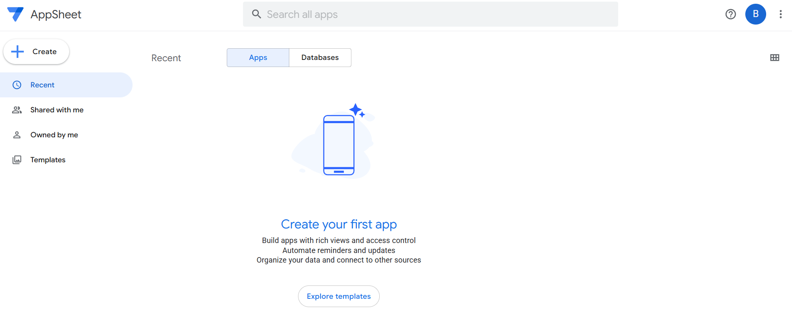

## 3. Criando o App
- Clique em "Create"

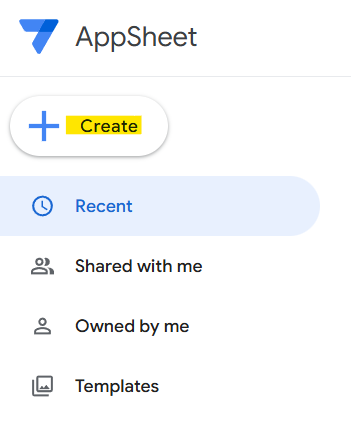

- Escolha "App" > "Start with existing data" > "Nome do aplicativo e categoria" > "choose your data"

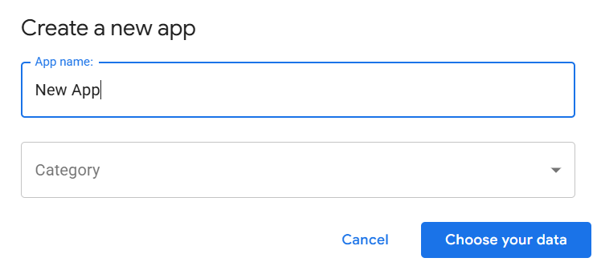

- Selecione a planilha Controle de Estoque que você criou

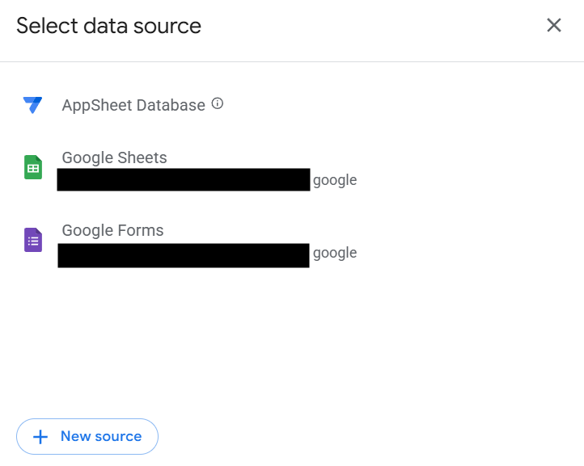
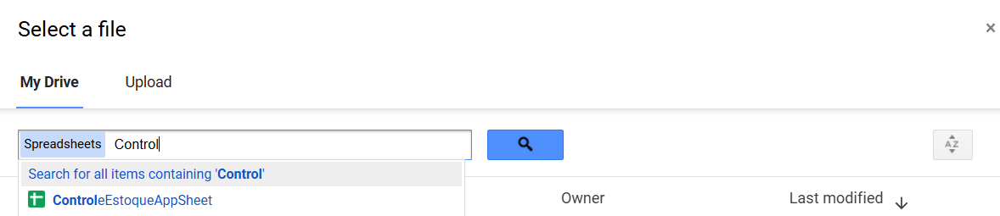

- O AppSheet vai gerar automaticamente uma interface inicial com base nas aba Estoque

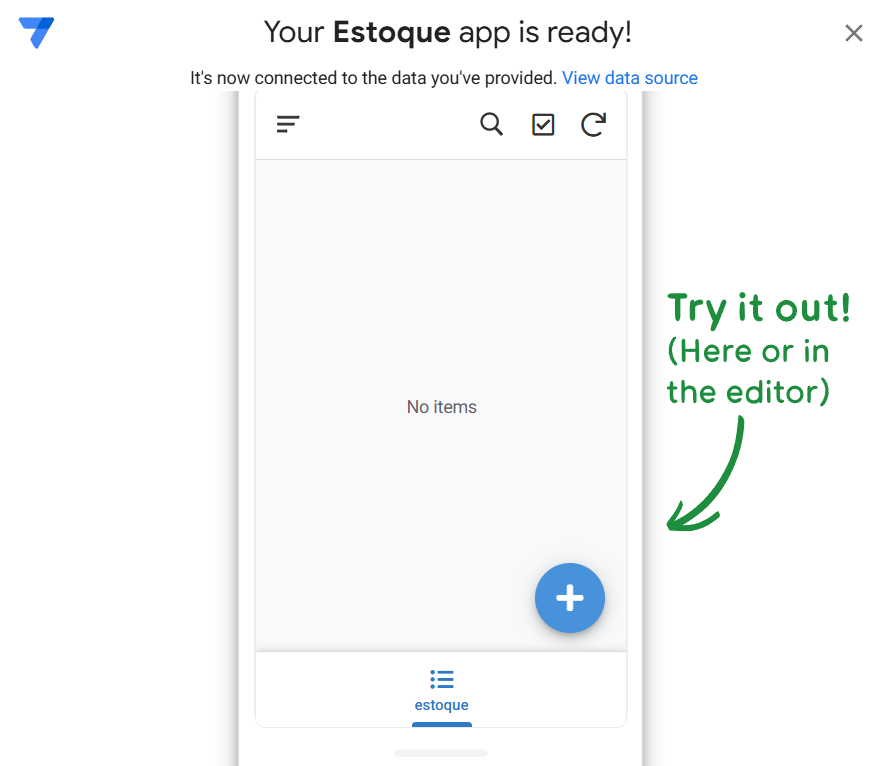

- Perceba que todas as colunas da planilha viraram campos que vamos utilizar, conforme a imagem.

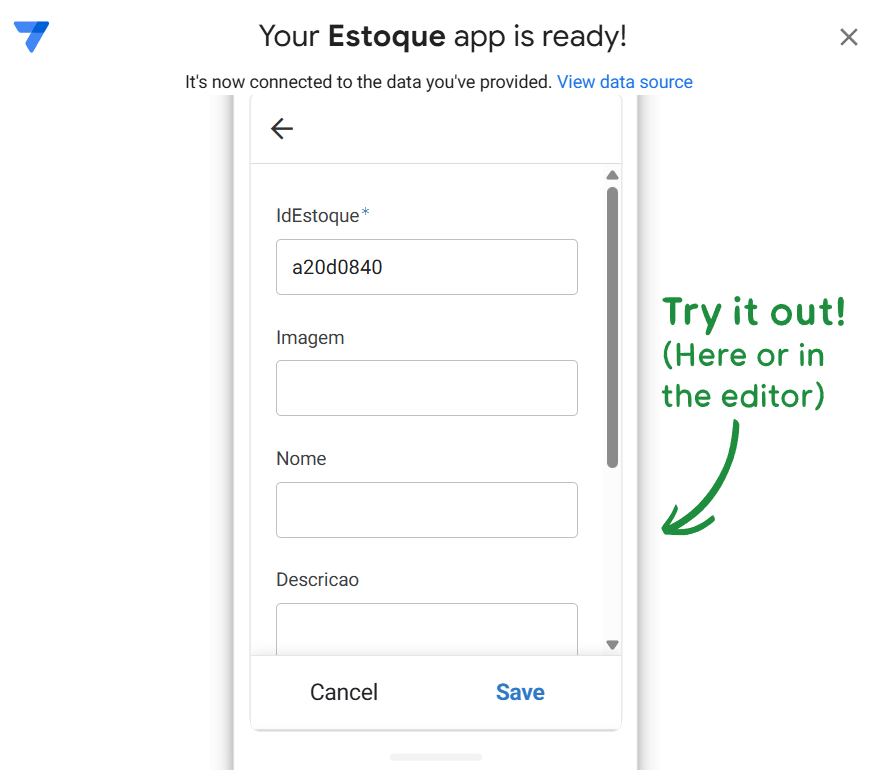

## 4. Personalizando e continuando o App

A. Adicionar as tabelas
    - Vá em Data > add new Data > add Table > Adicione Compras e depois Vendas

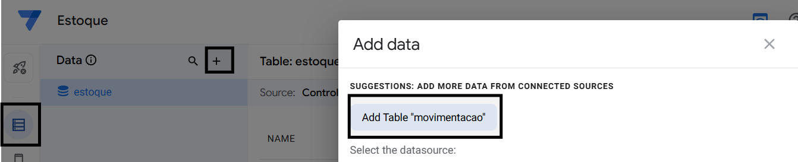

- Feito isso, sua visão de "data", deve se parecer com o da imagem abaixo
    
    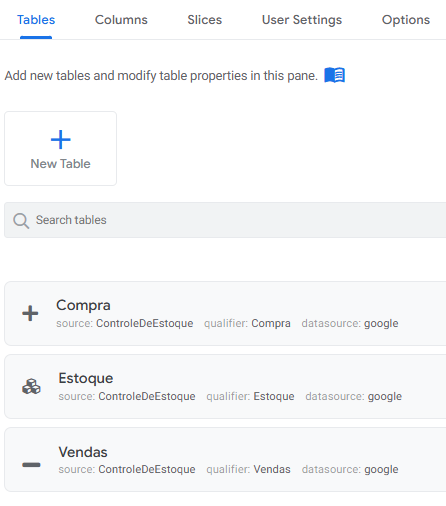

---

### B. Ajustando o drive
- Vá em Menu > Info > Properties > App properties > Role ate o final da pagina localizando a informação de "Default app folder"

    ![alt text]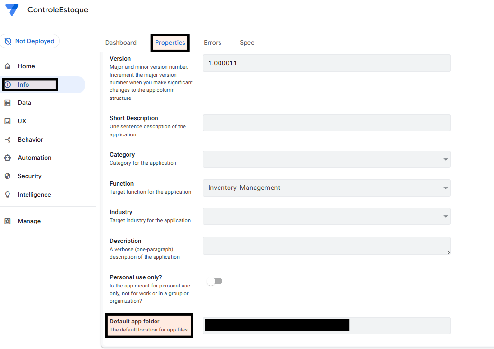

- Mova a planilha que você criou para esse diretorio, após localizar a pasta no seu drive

---

### C. Configuração das tabelas
- Vá em Data > Columns > Selecione a opção da tabela Estoque, por onde vamos iniciar, sua visão deve ser algo parecido com a imagem abaixo:

    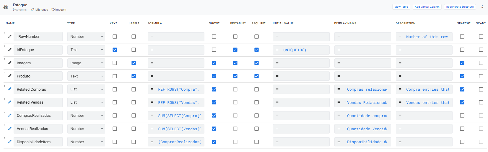

        - Atenção, as colunas Related Compras e Related Vendas, não precisam ser criadas manualmente.
        - As colunas ComprasRealizadas, VendasRealizadas e DisponibilidadeItem, devem ser criadas manualmente, utilizando o Add Virtual Column

    - Formula utilizada na coluna ComprasRealizadas = SUM(SELECT(Compra[Quantidade], [Produto] = [_THISROW].[IdEstoque]))
    - Formula utilizada na coluna VendasRealizadas = SUM(SELECT(Vendas[Quantidade], [Produto] = [_THISROW].[IdEstoque]))
    - Formula utilizada na coluna DisponibilidadeItem = [ComprasRealizadas] - [VendasRealizadas]

    - Display name utilizado na coluna Related Compras = 'Compras relacionadas'
    - Display name utilizado na coluna Related Vendas = 'Vendas Relacionadas'
    - Display name utilizado na coluna ComprasRealizadas =  'Quantidade Comprada'
    - Display name utilizado na coluna VendasRealizadas = 'Quantidade Vendida'
    - Display name utilizado na coluna DisponibilidadeItem = 'Disponibilidade do item'

            - Atenção na coluna Foto, clique no lapis, localizado ao lado direito da coluna.
            - Identifique Type Details > Image/File folder Path > 'ProdutosImg'

        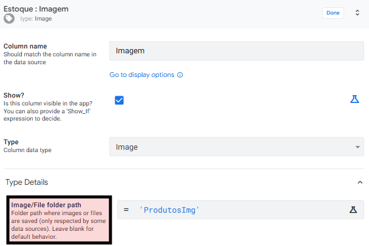

- Vamos realizar um processo parecido para a tabela Vendas

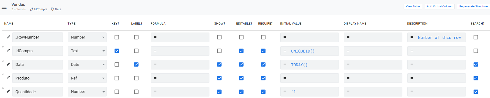    

    - Atenção ao selecionar Ref na coluna Produto siga os passos
    - Clique no lapis, localizado ao lado direito da coluna Produto
    - Identifique Type Details > Source Table > Estoque

     - Atenção, na coluna Quantidade, clique no lapis, localizado ao lado direito da coluna.
            - Type Details >
            - Show thousands separator: Ativado
            - Display mode: Label
            - Minimum Value: 1
    
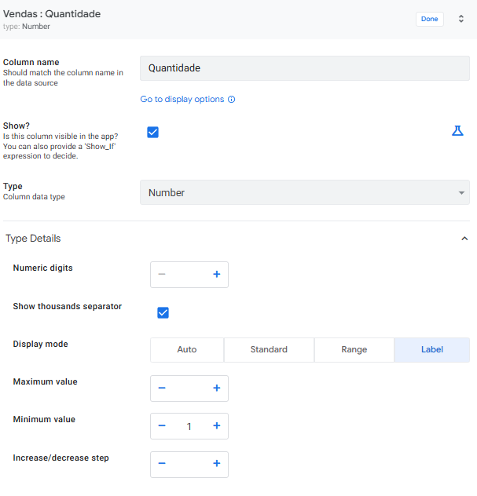

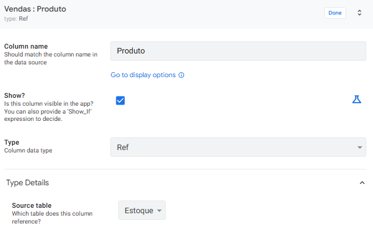

- Vamos realizar o mesmo processo para a tabela Compras

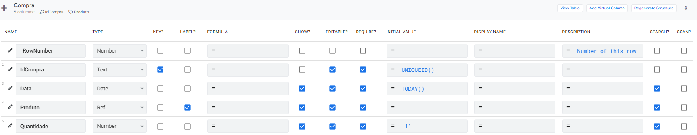

    - Atenção, repita o mesmo processo de edição na coluna quantidade, feitas na tabela de Vendas
---

### D. Adicionando o primeiro produto
- Utilize a visualização lateral para cadastrar o produto

    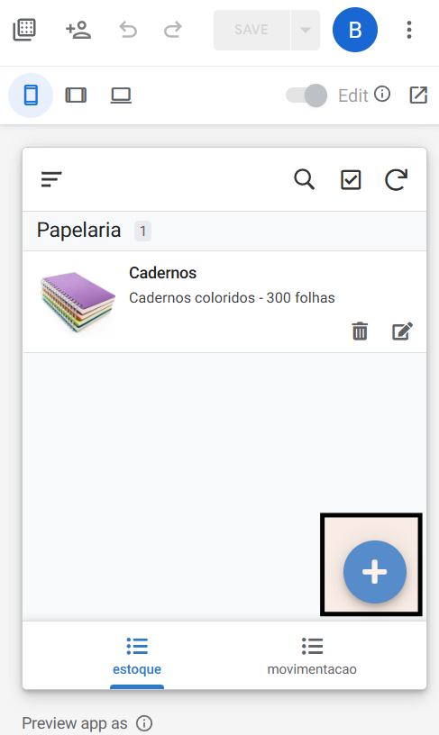
    
         - Atenção, após adicionar o produto, verifique no seu drive se foi criada a pasta chamada *ProdutosImg*
    
    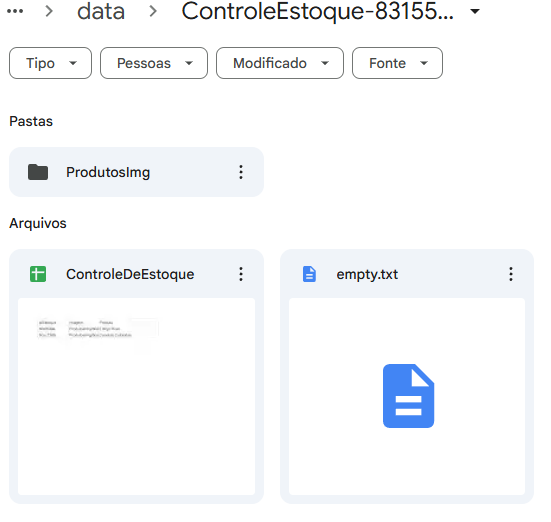

---  
### E. Criando a visualização das telas

 - Vá em UX > Views > New Views

  #### Configuração da tabela Compras

  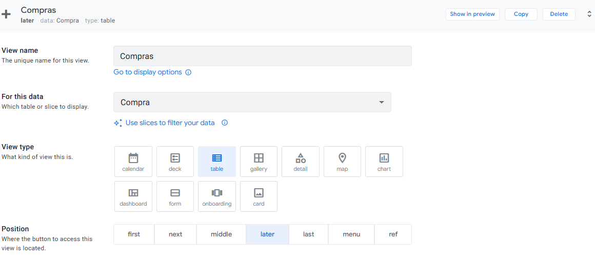

  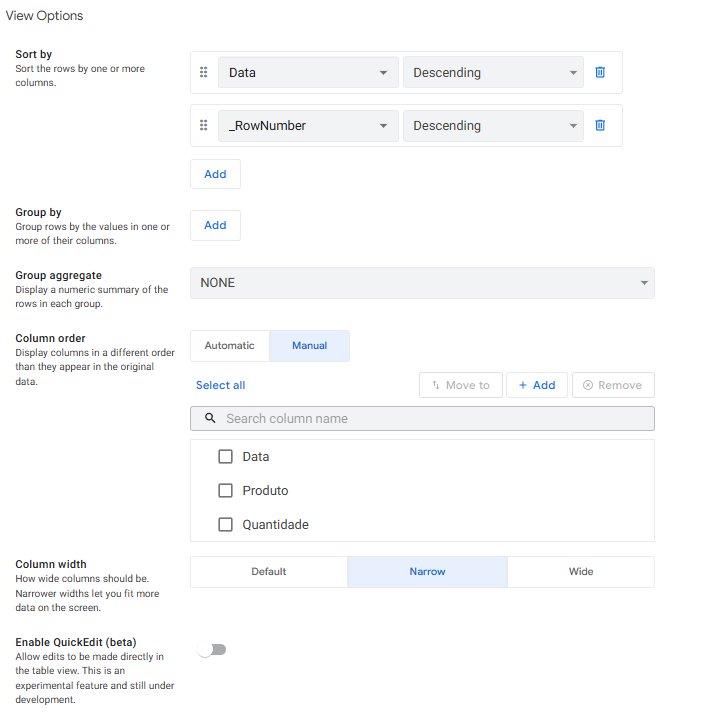

  #### Configuração da tabela Estoque

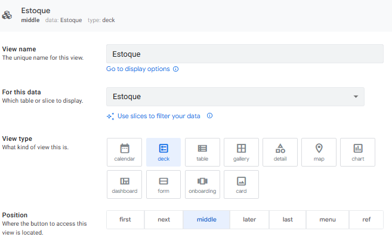

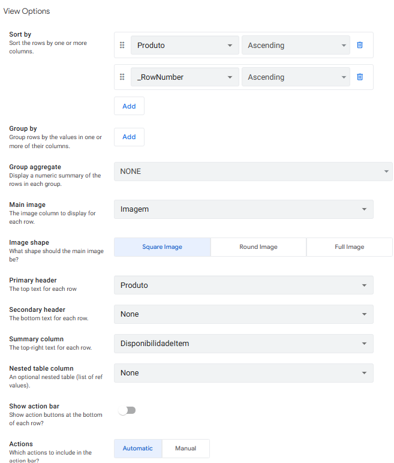

#### Configuração da tabela Vendas
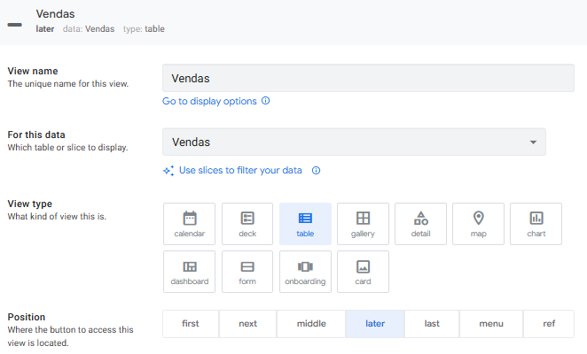

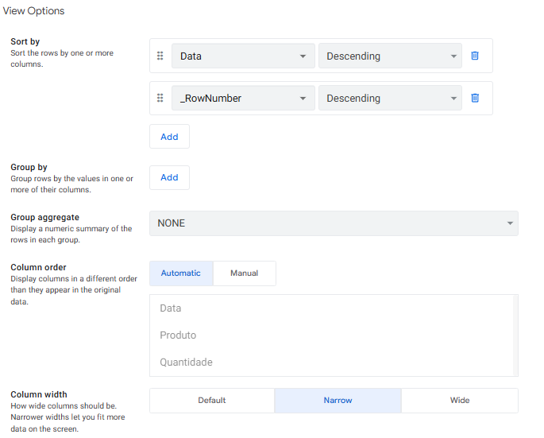

---
### F. Compartilhando seu app

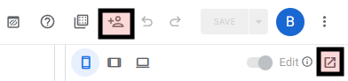

### Visualização do app no browser

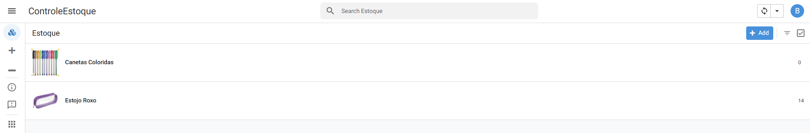

### Visualização do app no mobile

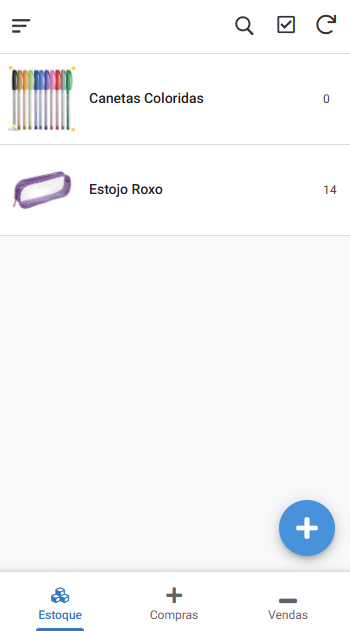

    

